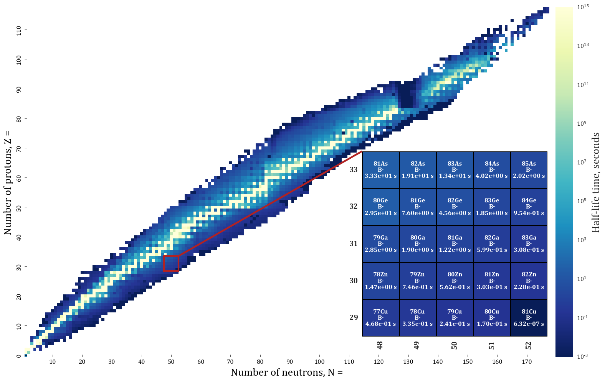
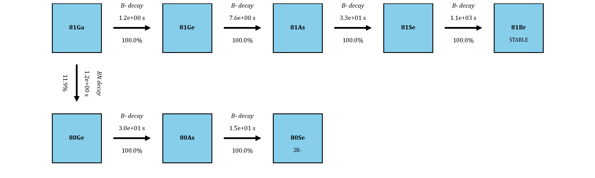
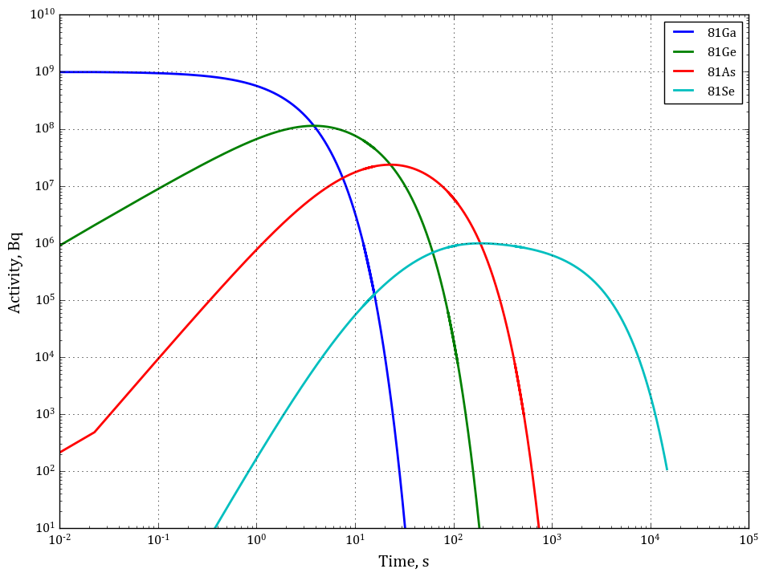

# Radioisotope map & Activity calculation

Tkinter viewer over the `IsotopeDB` database built by the
[Online mySQL application](<../Online mySQL application>). Enter an isotope and
it produces three tabs.

## Isotope map

Half-life heatmap of the whole chart of nuclides, log-scaled, with a zoomed
inset around the isotope you entered.



## Decay chains

The chain from that isotope down to a stable nuclide, annotated with decay mode,
branching ratio and half-life.



## Activity plot

Bateman-equation activity of every member of the chain against time, starting
from `initial_activity` becquerel of the parent.



## Running

```bash
python HeatMap.py
```

Set `ISOTOPEDB_GUEST_PASSWORD` first, or enter it at the prompt. Host, user,
database, output directory and the default isotope are set in `config.ini`;
`config.local.ini` overrides it and is gitignored.

The PNGs above are sample output and are regenerated into `Results/` on each
run.
