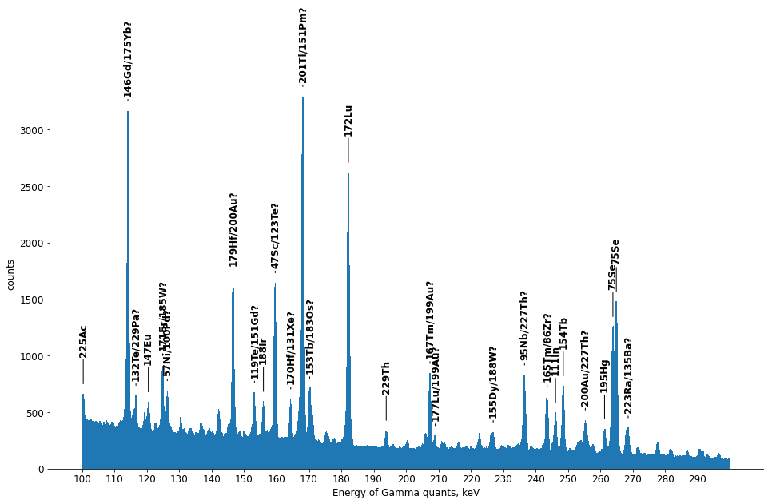

# Spectrum Analyzer

Reads an Ortec/Maestro `.Spe` gamma spectrum, locates peaks, identifies them
against a gamma library, fits Gaussians to the peaks of interest, and derives
the sample activity and production yield.



## Running

```bash
python spectrum_reader.py
```

Out of the box it analyzes the bundled `Test File.Spe`, whose strongest
identified line is the 140.5 keV Tc-99m gamma. Results are appended to
`report.txt` and the fits are shown as matplotlib windows.


## Configuration

Everything run- and sample-specific lives in `settings.ini`:

- `[paths]` — spectrum file, gamma library, report file, header encoding.
- `[spectrum]` — energy calibration. `calibration = file` uses the `$MCA_CAL` /
  `$ENER_FIT` polynomial stored in the `.Spe` file, which is correct for any
  channel count. `calibration = linear` restores the old behaviour of spreading
  `energy_max_kev` evenly over every channel.
- `[peak_detection]` — detection sensitivity and the per-energy-band thresholds,
  expressed in keV rather than raw channel numbers.
- `[sample]` — irradiation date and time, half-life, gamma yield, counting
  efficiency, attenuation coefficient, beam current.
- `[analysis]` / `[plot]` — which peaks to fit and the summary plot window.

Put machine-specific overrides in `settings.local.ini`; it is gitignored and
takes precedence.

## Method

1. Parse `$DATA:`, `$MEAS_TIM:`, `$DATE_MEA:` and the calibration polynomial.
2. Smooth with a symmetric 3-point moving average.
3. Apply a background-suppressing convolution filter (narrow positive core,
   wide negative wings).
4. Threshold band by band and take the tallest channel of each surviving run.
5. Match each peak against `gamma_library.txt` within `match_tolerance_kev`,
   ranking candidates by emission intensity decayed to the acquisition time.
6. Fit one Gaussian (isolated peak) or two (overlapping peaks), integrate the
   net area and convert the count rate to activity and yield.
