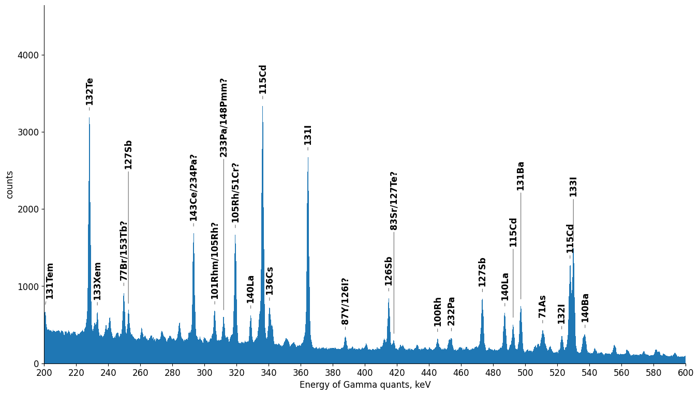
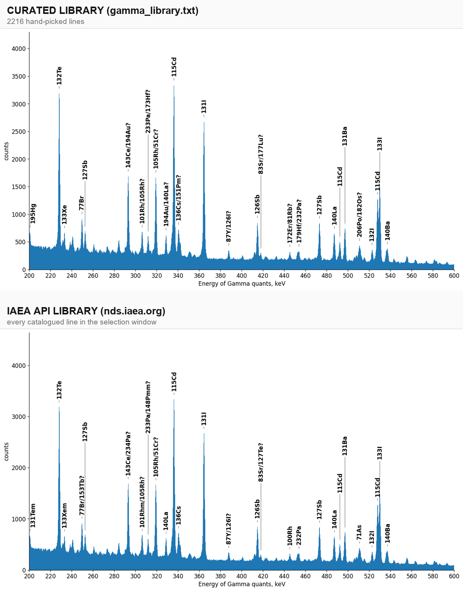
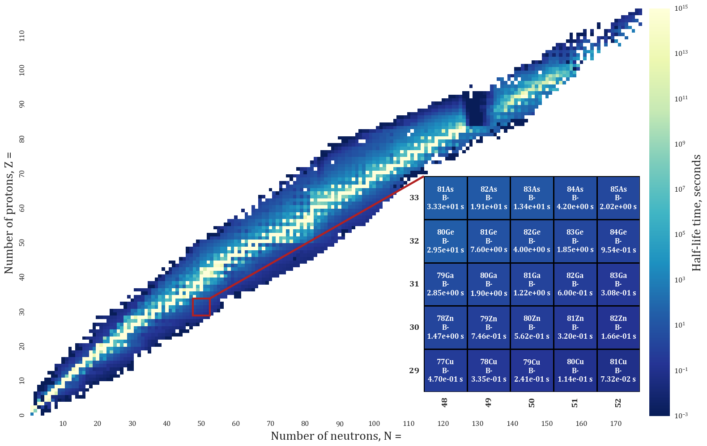
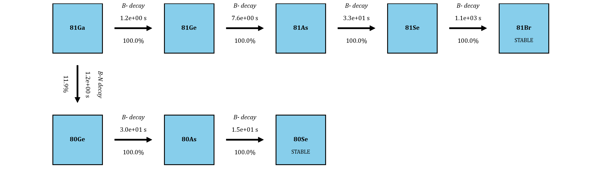

# api-based

The gamma-spectrum analyzer and the nuclide chart viewer rebuilt on the
public [IAEA Live Chart of Nuclides API](https://nds.iaea.org/relnsd/vcharthtml/api_v0_guide.html)
(`nds.iaea.org`) instead of local data files and a private MySQL database.

Both tools import their pipeline and figure code from the original projects —
only the data layer differs — so results are directly comparable between the
file-based and API-based versions. All figures, with commentary and the
comparison against the file-based versions, are collected in
[sample_outputs.pdf](sample_outputs.pdf).



| Script | Replaces | Data source |
| --- | --- | --- |
| `analyze_spectrum_api.py` | `gamma_library.txt` | per-nuclide decay radiation (`fields=decay_rads`) |
| `nuclide_chart_api.py` | `IsotopeDB` (MySQL) | bulk ground states (`fields=ground_states&nuclides=all`) |

## Usage

```bash
python analyze_spectrum_api.py
```

```bash
python nuclide_chart_api.py
```

No database or credentials are needed. Spectrum settings (file, peaks,
sample parameters) still come from `../gamma-spectrum-analyzer/settings.ini`.

## Data handling

- Every API response is cached under `cache/` (gitignored), so repeated runs
  are offline and instant.
- The assembled gamma library is committed as `data/api_gamma_library.csv`.
  Delete it to force a rebuild from the live API (~1000 small requests,
  a few minutes). Selection windows (parent half-life, line intensity,
  energy range) are constants at the top of `iaea_client.py`.

## Differences from the file-based versions

The curated `gamma_library.txt` carries ~2k hand-picked lines; the API library
carries every catalogued line in the selection window (~50k), so ambiguous
peaks can resolve differently. Two systematic effects are worth knowing:

- **Equilibrium half-lives.** The curated library was built by hand with
  transient equilibrium deliberately encoded in the half-life field: a
  generator-fed daughter is listed under the half-life of the nuclide that
  rate-limits its decay in a real sample, not its own. Its 140.5 keV entry
  carries the 66 h half-life of the feeding 99Mo rather than the 6 h of 99mTc
  itself, which is exactly how that activity behaves in a sample days after
  irradiation. The raw API reports each state's own half-life, and the
  ranking then discards short-lived daughters that are in fact still present
  through their parent.
- **Natural background.** The ranking scores lines by production-and-decay
  plausibility, which correctly favours activation products — and therefore
  ranks primordial background lines (40K at 1461 keV) below them, where the
  small curated library had no competitors in the window.

## The post-pull curation stage

`curate_library()` in `iaea_client.py` reproduces both effects on the pulled
dataset, so the hand curation becomes a computed transform:

- **Equilibrium propagation.** `feeder_half_lives()` builds the nuclide
  feeding graph from the ground-states decay modes (branches ≥ 1 %) and
  propagates each feeder's decay timescale down its chains to a fixed point.
  Every gamma line is then assigned
  `eff_hl_sec = max(state half-life, rate-limiting feeder half-life)`,
  with feeders capped at one year so primordial chains do not masquerade as
  activation equilibria. The computed values land on the hand-curated ones:
  99mTc 6.0 h → 65.9 h (99Mo), 140La 1.68 d → 12.75 d (140Ba),
  132I 2.3 h → 3.2 d (132Te).
- **Background pinning.** A dozen well-known ambient lines (40K, 214Bi/Pb,
  208Tl, 228Ac, 137Cs, …) are pinned to a fixed 30 d effective half-life:
  a constant room-background line competes like a slowly decaying source
  instead of being ranked away for its primordial half-life.
- **Reachable products.** The sample context is a proton-irradiated 232Th
  target: candidate parents must be fission fragments or light activation
  products (Z ≤ 66) or actinides from (p,xn) and the target's own chain
  (Z 88–93). Nothing populates the lead–astatine gap between, so lines from
  it are dropped (background-pinned lines exempt). Set `REACHABLE_Z_RANGES`
  to `[]` to disable for a different sample.

The committed `data/api_gamma_library.csv` keeps the raw `state_hl_sec` next
to the effective values and a `background` flag, so the manipulation stays
inspectable, and each step can be disabled through the constants at the top
of `iaea_client.py`. With the full curation stage on, identification agreement
with the curated library reaches 48 of 59 peaks. Most remaining differences
are peaks where the complete line list argues for a different fission product
than the curated set offered — several confirmed by sibling lines both
libraries agree on — plus the actinide K X-rays near 93–98 keV and the 511 keV
annihilation line, which no gamma library can name correctly.

Nuclide data otherwise reflects current IAEA evaluations rather than the
2013-era NuDat export; several half-lives that were placeholders there are
measured values here.



## Nuclide chart from the API

The chart viewer draws the same figures as the database version from the bulk
ground-states table — 3386 nuclides in one request. The 81Ga decay chain comes
out identical member for member, including the 11.9 % beta-delayed-neutron
branch:




