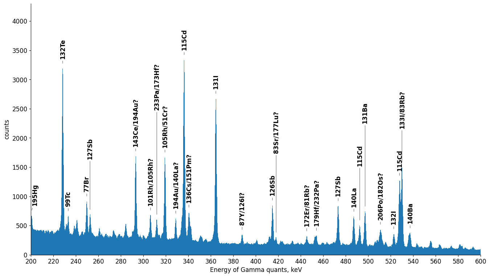
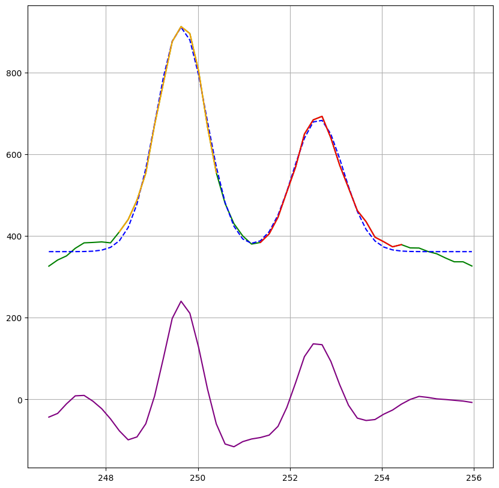

# gamma-spectrum-analyzer

Analyzes gamma spectra from neutron- or proton-activated samples. Reads an
Ortec/Maestro `.Spe` file, locates peaks, identifies the emitting isotopes
against a gamma library, fits Gaussians to the peaks of interest, and derives
the sample activity and production yield.



## Running

```bash
python analyze_spectrum.py
```

Out of the box it analyzes the bundled `test_spectrum.Spe` — a 1083 s
acquisition taken five days after a proton irradiation — whose strongest line
is the 140.5 keV Tc-99m gamma. Fit results are printed, appended to
`report.txt`, and shown as matplotlib windows.

All figures, with commentary, are collected in
[sample_outputs.pdf](sample_outputs.pdf).



## Configuration (`settings.ini`)

- `[paths]` — spectrum file, gamma library, report file, header encoding.
- `[spectrum]` — energy calibration: `file` uses the `$MCA_CAL`/`$ENER_FIT`
  polynomial stored in the `.Spe` file; `linear` spreads `energy_max_kev`
  evenly over all channels.
- `[peak_detection]` — detection sensitivity and per-band thresholds in keV.
- `[sample]` — irradiation date, half-life, gamma yield, counting efficiency,
  attenuation, beam current.
- `[analysis]` / `[plot]` — peaks to fit and the summary plot window.

Machine-specific overrides go in the gitignored `settings.local.ini`.

## Method

1. Parse `$DATA:`, `$MEAS_TIM:`, `$DATE_MEA:` and the calibration polynomial.
2. Smooth with a symmetric 3-point moving average.
3. Apply a background-suppressing convolution filter (narrow positive core,
   wide negative wings).
4. Threshold band by band; the tallest channel of each surviving run is a peak.
5. Match each peak against `gamma_library.txt` within `match_tolerance_kev`,
   ranking candidates by emission intensity decayed to the acquisition time.
6. Fit one Gaussian (isolated peak) or two (overlapping peaks), integrate the
   net area, and convert the count rate to activity and yield.
