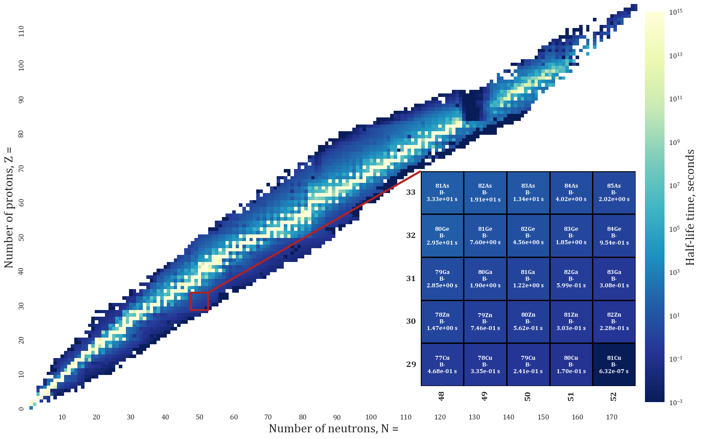
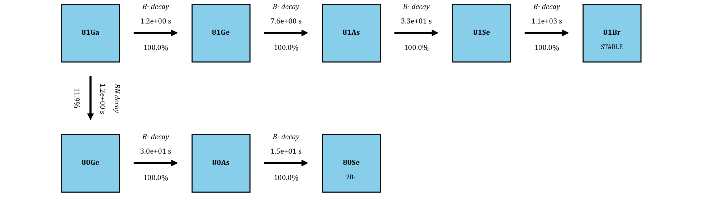
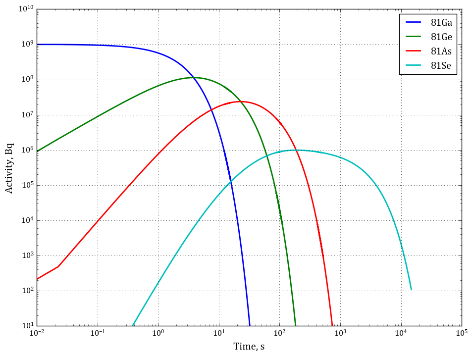

# nuclide-chart-viewer

Tkinter viewer over the `IsotopeDB` database built by
[isotope-database-builder](../isotope-database-builder). Type an isotope name
and it produces three tabs. All figures, with commentary, are collected in
[sample_outputs.pdf](sample_outputs.pdf).

## Isotope map

Half-life heatmap of the whole chart of nuclides, log-scaled, with a zoomed
inset around the chosen isotope.



## Decay chains

The chain from that isotope down to a stable nuclide — branching ratios,
half-lives and decay modes on each arrow, including beta-delayed branches.



## Activity plot

Activity of every chain member against time, starting from `initial_activity`
becquerel of the parent. The decay system is solved by matrix exponential, so
chains whose members share a half-life are handled exactly.



## Running

```bash
python nuclide_chart_viewer.py
```

Set `ISOTOPEDB_GUEST_PASSWORD` first, or enter it at the prompt. Host, user,
database, output directory and the default isotope are set in `config.ini`;
the gitignored `config.local.ini` overrides it.

The PNGs above are sample output for `81Ga` and are regenerated into
`Results/` on every run.
